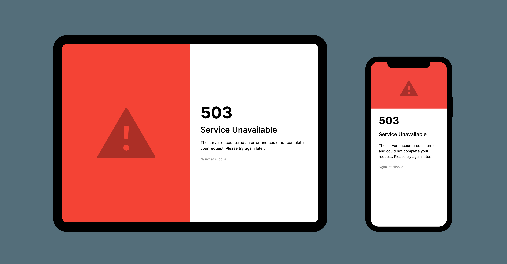

<!-- SPDX-License-Identifier: MIT OR CC0-1.0 -->
<!-- SPDX-FileCopyrightText: 2021 Johannes Siipola -->

# Nice Nginx Error Page

What if your application could look nice even when it's crashing? Try this custom error page for Nginx.



## Preview

* [401 Unauthorized](https://joppuyo.github.io/nice-nginx-error-page/401.html)
* [404 Not Found](https://joppuyo.github.io/nice-nginx-error-page/404.html)
* [500 Internal Server Error](https://joppuyo.github.io/nice-nginx-error-page/500.html)

## Installation

Copy `templates/custom-error-page` folder in your web root folder, for example `/usr/share/nginx/html`.

Copy `config/custom-error-page` folder into your nginx config directory, for example `/etc/nginx/conf.d/`.

Edit `custom-error-page/http-statuses.conf` so the `root` values point to the correct folder on your server.

In your main nginx config file, include `custom-error-page/http-statuses.conf` outside the server block (that is, inside the http block), like this:

```
include /etc/nginx/conf.d/custom-error-page/http-statuses.conf;
# ^ Add this line

server {
  listen 80;
  listen [::]:80;
  server_name localhost;
  # Your server configs here
}
```

Restart Nginx and you're done.

In your nginx config file, include `custom-error-page/error-page.conf` inside your server block, like this:

```
include /etc/nginx/conf.d/custom-error-page/http-statuses.conf;

server {
  listen 80;
  listen [::]:80;
  server_name localhost;
  
  include /etc/nginx/conf.d/custom-error-page/error-page.conf;
  # ^ Add this line
  
  # Your server configs here
}
```

Feel free to modify the error template to your liking!

## FAQ

### I'm using Nginx with fastcgi_pass or proxy_pass and I see an error page from the upstream instead of the custom one

By default, Nginx will use the error pages from upstream if they are available. Nginx will only show it's own error pages if it can't connect to the upstream server. For example in case of timeout or if the upstream is down. You can override this behavior by setting `fastcgi_intercept_errors on;` or
`proxy_intercept_errors on;`.

### I'm using intercept_errors but I would like to still show the custom 404 from my application server.

You can accomplish this by removing `404` from the list of statuses in `error_page` directive, in the file `custom-error-page/error-page.conf`. TODO: check if this actually works.

## Thanks

I would like to thank the article [One NGINX error page to rule them all](https://blog.adriaan.io/one-nginx-error-page-to-rule-them-all.html) for inspiration. Using Server Side Includes drastically cuts down the number of required templates.

## License

MIT since the error page uses a MIT-licensed minireset.css library, and the Inter font which is licensed under the SIL Open Font License. All other files are dual-licensed under MIT and CC0-1.0 license.
